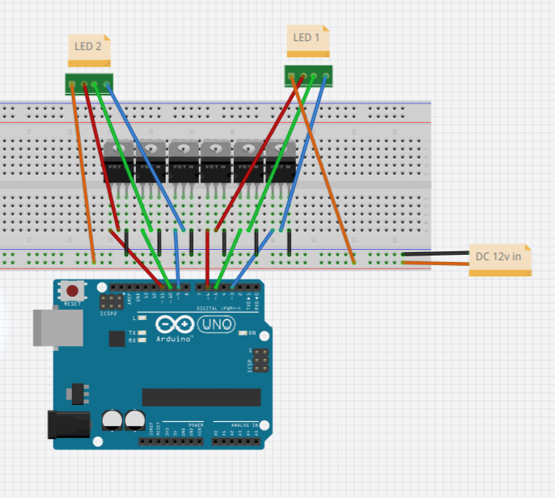

# dual-led
Use your Arduino Uno as a DMX slave device to control 2 sets of 12v RGB LEDs.

## You'll need
- **1x** Arduino Uno
- **1x** DMX shield (I'm using [this one](https://www.amazon.com/Arduino-Populated-NEUTRIK-Connectors-Transponder/dp/B0974KJ2YW/))
- **6x** N-channel power MOSFET (P30N06LE for example)
- **2x** 12 volt RGB LEDs. These can be single, an array, or a strip.
- **1x** 12 volt power supply
- soldering iron and solder, some wire (4-core for the LEDs, DuPont for the Arduino unless you want to solder directly to it)
- (optional) **1x** 12v->5v DC converter. This is if you want one power supply for the whole system if you dont want to have a separate usb power source for the Arduino
- (optional) **1x** perfboard/solderable breadboard for organizing the MOSFETS

## Usage
- build this circuit:
- 
- upload dual-led.ino to the Arduino
- Plug in your DMX controller
- Unless you changed it in the code, the starting address is 49
- use channels 1-8 relative to the starting address to control the lights

## Additional info (kind of important)
- The DMX shield has a few tabs on the top for some settings. Here's where they should be (top to bottom, with the DMX connectors facing away from you):
    - **EN** when uploading code, otherwise **EN**
    - **Slave**
    - **TX-uart**
    - **RX-uart**
- Ideally you should have a DMX terminator (120&Omega; resistor across DMX pins 2 and 3)
    - It's less important if this is your only device or if you only have a couple of simple devices in a daisy chain
    - Good practice to include one if you can.

